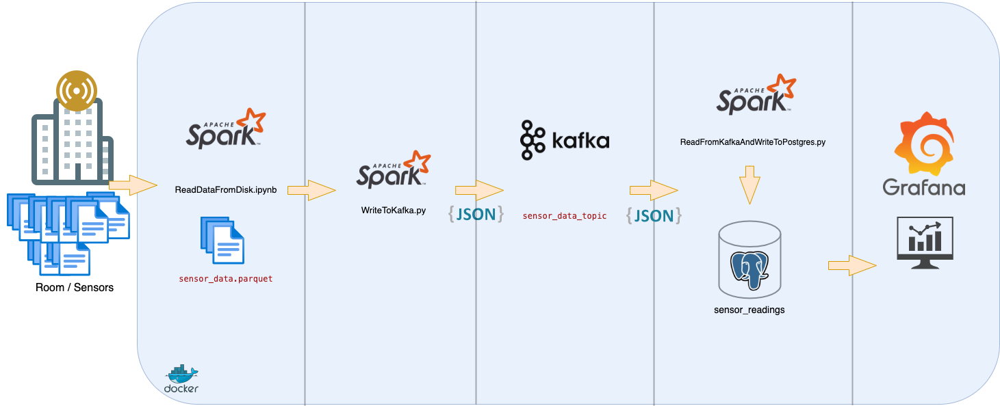
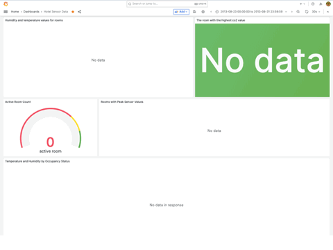

# Otel Sensör Verileri Dashboard’u

Bu proje, bir otelin birden fazla odasından gelen sensör verilerini (CO2, nem, ışık, PIR, sıcaklık) gerçek zamanlı olarak işleyen ve görselleştiren bir veri akış hattını gösterir. Apache Spark, Kafka, PostgreSQL ve Grafana kullanılarak, veri akışı simüle edilmiş, işlenmiş, bir veritabanında saklanmış ve dinamik bir dashboard üzerinde her 30 saniyede bir güncellenerek görselleştirilmiştir. Veri seti, UC Berkeley’deki Sutardja Dai Salonu’ndan, Ağustos 2013’te bir haftalık süre boyunca 51 odadaki 255 sensörden toplanmıştır.

## Veri Kaynağına Ait Linkler
- https://www.kaggle.com/ranakrc/smart-building-system

- https://github.com/erkansirin78/datasets/raw/master/sensors_instrumented_in_an_office_building_dataset.zip

## Proje Genel Bakış

Projenin amacı:
- Birden fazla kaynaktan gelen sensör verilerini birleşik bir formatta toplamak.
- Verileri Kafka üzerinden gerçek zamanlı olarak akışa almak.
- İşlenen verileri PostgreSQL’de saklamak.
- Grafana ile verileri dinamik bir dashboard’da görselleştirmek, her 30 saniyede bir güncelleme sağlamak.

Sensör okumalarının gerçek zamanlı olarak geldiği bir senaryoyu simüle ederek, oda koşullarına (örneğin, doluluğa bağlı sıcaklık/nem değişimleri) dair bilgiler sunar.

## Mimari

Proje mimarisi şu bileşenlerden oluşur:
- **Apache Spark**: Veri alımı, dönüşüm ve akış işlemleri için.
- **Apache Kafka**: Sensör verilerinin akışı için.
- **PostgreSQL**: İşlenen verilerin kalıcı depolanması için.
- **Grafana**: Sensör metriklerinin gerçek zamanlı görselleştirilmesi için.
- **Docker**: Tüm servislerin konteynerleştirilmiştir.



## Adımlar

### 1. Veri Alımı ve Dönüşüm
- **Kaynak**: `sensor_data/KETI` dizinindeki sensör verileri, oda ve sensör tipine (CO2, nem, ışık, PIR, sıcaklık) göre düzenlenmiş.
- **Süreç**:
  - CSV dosyalarını her sensör tipi için ayrı Spark DataFrame’lere okundu.
  - Unix epoch zaman damgaları insan tarafından okunabilir zaman damgalarına çevrildi.
  - Dakika bazında ortalamalar (`avg_co2`, `avg_humidity`, vb.) hesaplanarak veriler toplulaştırıldı.
  - DataFrame’ler birleştirilerek tek bir DataFrame oluşturuldu: `sensor_datetime_hm`, `room_id`, `avg_co2`, `avg_humidity`, `avg_light`, `avg_pir`, `avg_temperature`.
  - Birleşik DataFrame, Parquet formatında diske kaydedildi (`output/sensor_data.parquet`).
- **Kod**: [ReadDataFromDisk.ipynb](ReadDataFromDisk.ipynb)

### 2. Kafka’ya Veri Akışı
- **Süreç**:
  - Parquet dosyasını Spark DataFrame’ine okundu.
  - DataFrame JSON formatına çevrildi.
  - JSON verileri, Spark Structured Streaming kullanılarak Kafka topic’ine (`sensor_data_topic`) yazıldı.
- **Kod**: [WriteToKafka.py](WriteToKafka.py)

### 3. PostgreSQL Tablo Kurulumu
- PostgreSQL veritabanı (`sensor_data`) ve tablo (`sensor_readings`) akış verilerini saklamak için oluşturuldu.

### 4. Kafka’dan PostgreSQL’e Akış
- **Süreç**:
  - Kafka topic’inden (`sensor_data_topic`) JSON verileri Spark Structured Streaming ile okundu.
  - JSON verileri, önceden tanımlı bir şemaya göre yapılandırılmış bir DataFrame’e parse edildi.
  - DataFrame, PostgreSQL’deki `sensor_readings` tablosuna ekleme modunda yazıldı.
  - Spark, her 1 dakikada bir toplu işleme yaptı (`trigger(processingTime="1 minute")`).
- **Kod**: [ReadFromKafkaAndWriteToPostgres.py](ReadFromKafkaAndWriteToPostgres.py)

### 5. Grafana ile Gerçek Zamanlı Görselleştirme
- **Kurulum**:
  - Grafana, PostgreSQL’e veri kaynağı olarak bağlandı.
  - Sensör metriklerini görselleştirmek için bir dashboard oluşturuldu; 

  

## Kurulum Talimatları

### Gereksinimler
- Docker ve Docker Compose
- Python 3.12
- Apache Spark 3.5.3
- Kafka 3.8.0
- PostgreSQL 15
- Grafana 9.5.0

### Kurulum
1. Depoyu klonlayın:
   ```bash
   git clone https://github.com/emrefkrlr/HotelSensorStream.git
   cd HotelSensorStream
   ```

2. Docker konteynerlerini başlatın:
   ```bash
   docker-compose up -d
   ```

3. Veri alımı ve dönüşüm işlemini çalıştırın:
   ```bash
    pwd
    /dataops/sensor_data

    wget "https://github.com/erkansirin78/datasets/raw/master/sensors_instrumented_in_an_office_building_dataset.zip" 

    unzip sensors_instrumented_in_an_office_building_dataset.zip

    rm -rf sensors_instrumented_in_an_office_building_dataset.zip

    ls -l
    total 0
    drwxr-xr-x 54 root root 1728 Apr 19 13:59 KETI
   ```

   `ReadDataFromDisk.ipynb` dosyasını açın ve tüm hücreleri çalıştırın.
   ```bash
    docker exec -it spark_client jupyter notebook --ip=0.0.0.0 --port=8888 --no-browser --allow-root

   ```

4. Kafka’ya topic oluştur:
    ```bash
   docker exec -it kafka /kafka/bin/kafka-topics.sh --create --topic sensor_data_topic --partitions 1 --replication-factor 1 --bootstrap-server localhost:9092
   ```

5. Veri tabanını hazırla:
    ```bash
    docker exec -it hotelsensorstream-postgres-1 psql -U postgres -d sensor_data

    CREATE TABLE sensor_readings (
      sensor_datetime_hm TIMESTAMP,
      room_id VARCHAR,
      avg_co2 DOUBLE PRECISION,
      avg_humidity DOUBLE PRECISION,
      avg_light DOUBLE PRECISION,
      avg_pir DOUBLE PRECISION,
      avg_temperature DOUBLE PRECISION
    );
    ```
6. Kafka’ya veri yazın:
   ```bash
   docker exec -it spark_client spark-submit \
     --packages org.apache.spark:spark-sql-kafka-0-10_2.12:3.5.3 \
     /dataops/WriteToKafka.py
   ```

7. Kafka’dan PostgreSQL’e veri akışını başlatın:
   ```bash
   docker exec -it spark_client spark-submit \
     --packages org.apache.spark:spark-sql-kafka-0-10_2.12:3.5.3,org.postgresql:postgresql:42.7.3 \
     /dataops/ReadFromKafkaAndWriteToPostgres.py
   ```

8. Grafana’ya erişin:
   - URL: `http://localhost:3000`
   - Kullanıcı adı: `admin`
   - Şifre: `admin`
   - PostgreSQL veri kaynağını yapılandırın ve dashboard’u içe aktarın/oluşturun.

### Dizin Yapısı
```
.
├── docs/
│   └── hoteldashboard.gif
├── spark/
│   ├── ReadDataFromDisk.ipynb
│   ├── WriteToKafka.py
│   ├── ReadFromKafkaAndWriteToPostgres.py
│   └── sensor_data/
├── kafka/
│   └── config/
│       └── server.properties
├── docker-compose.yml
└── README.md
```

## Sonuçlar
- Akış hattı, 51 otel odasından gelen sensör verilerini başarıyla işler, dakika bazında toplulaştırır ve Kafka üzerinden PostgreSQL’e aktarır.
- Grafana dashboard’u, oda koşullarına dair gerçek zamanlı bilgiler sunar ve her 30 saniyede bir güncellenir.

